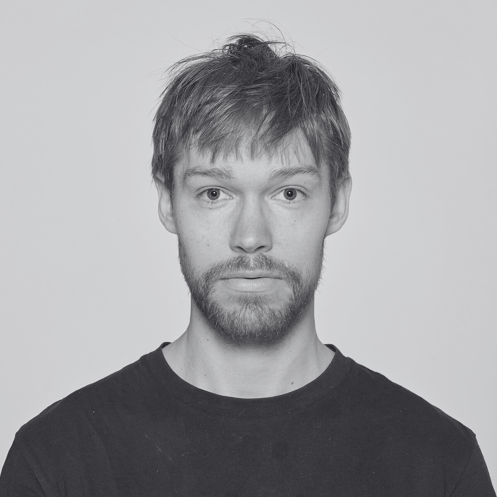

<!--  

<b></b>

 <b></b> <i></i>

l -->

# About

I am a PhD student in the Foundations of Machine Learning Group at Aarhus University, led by [Kasper Green Larsen](https://cs.au.dk/~larsen/) whom I am also grateful to have as my advisor. Before starting my PhD, I received a Bachelor's degree from the Mathematics Department at Aarhus University and a Master's degree in Statistics from the Statistics Department at Aarhus University. My primary research interest is learning theory.
<b>My PhD study is set to end at August 2025, and I am currently seeking either a PostDoc position or a full-time role. Any help or advice will be greatly appreciated!</b>

<!-- #### My PhD study is set to end at August 2025, and I am currently seeking either a PostDoc position or a full-time role. Any help or advice will be greatly appreciated! -->

# Publications
Work by my Brilliant co-authors and me. I am thankful for their insights and collaboration, which have helped me grow.

### 2025

Understanding Aggregations of Proper Learners in Multiclass Classification\
Co-Authors: Julian Asilis, Grigoris Velegkas\
Conference: lALT 2025l

Efficient Optimal PAC Learning\
Co-Authors: \
Conference: lALT 2025l

### 2024

Majority-of-Three: The Simplest Optimal Learner?\
Co-Authors: Ishaq Aden-Ali, Kasper Green Larsen, Nikita Zhivotovskiy\
Conference: lCOLT 2024l

Optimal Parallelization of Boosting\
Co-Authors: Arthur da Cunha, Kasper Green Larsen\

Conference: lNeurIPS 2024 - Oral top 0.39% of submissionsl

Conference: lNeurIPS 2024  **Oral top 0.39% of submissions**

Conference: lNeurIPS 2024 - l <b> Oral top 0.39% of submissions</b>

The Many Faces of Optimal Weak-to-Strong Learning\
Co-Authors: Kasper Green Larsen, Markus Engelund Mathiasen\
Conference: lNeurIPS 2024 Orall

Sparse Dimensionality Reduction Revisited\
Co-Authors: Lior Kamma, Kasper Green Larsen, Jelani Nelson, Chris Schwiegelshohn\
Conference: lICML 2024l

### 2023
The Fast Johnson-Lindenstrauss Transform Is Even Faster\
Co-Authors: Ora Nova Fandina, Kasper Green Larsen\
Conference: lICML 2023l

AdaBoost is not an Optimal Weak to Strong Learner\
Co-Authors: Kasper Green Larsen, Martin Ritzert\
Conference: lICML 2023 - Oral top 2.37% of submissions l

Barriers for Faster Dimensionality Reduction\
Co-Authors: Ora Nova Fandina, Kasper Green Larsen\
Conference: lSTACS 2023l

Optimally Interpolating between Ex-Ante Fairness and Welfare\
Co-Authors: Panagiotis Karras, Wenyu Ma, Nidhi Rathi, Chris Schwiegelshohn\
Pre-print: lARXIVl

